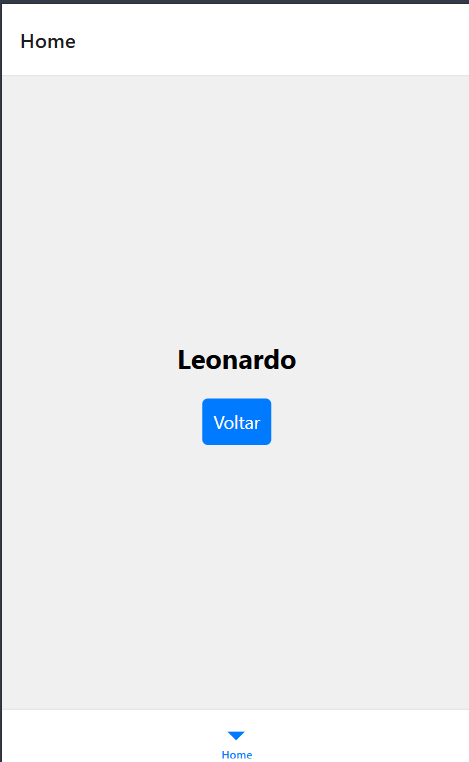

## 📱 Mobile Gestures
Mobile Gestures é um repositório voltado para o desenvolvimento e testes de gestos interativos em aplicações React Native, com foco em animações suaves e experiência do usuário moderna. Utilizando bibliotecas como react-native-gesture-handler e react-native-reanimated, o projeto demonstra como implementar os gestos mais comuns e úteis no ambiente mobile.

## ✨ Funcionalidades
👆 Tap (Toque simples)

✌️ Double Tap (Toque duplo)

👉 Drag & Drop (Arrastar e soltar)

🔁 Swipe (Deslizar lateral/vertical)

🤏 Pinch (Zoom com dois dedos)

🕒 Long Press (Pressionar e segurar)

⚡ Animações com Reanimated para transições suaves e responsivas

## 🛠 Tecnologias utilizadas
React Native

React Native Gesture Handler

React Native Reanimated

Expo

## Como rodar o projeto 🚀

### Clone o repositório
git clone https://github.com/PedroLeoo07/Mobile_gestures
### Acesse a pasta
cd Mobile_gestures

### Instale as dependências
npm install

### Inicie o app (via Expo)
npx expo start
   

## 📸 Demonstração

## 📌 Contribuição
Sinta-se à vontade para abrir issues, sugerir melhorias ou contribuir com novos exemplos de gestos.